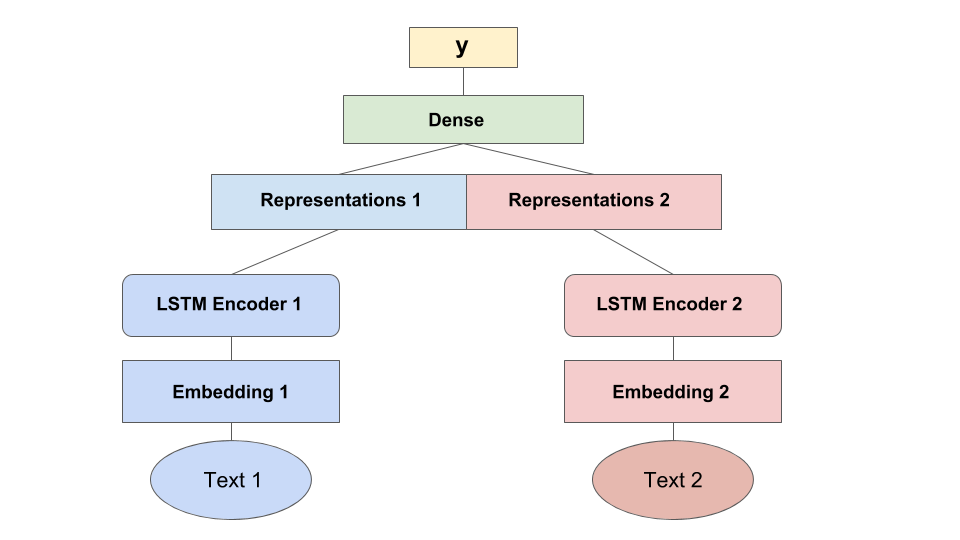

# Siamese_SentenceSimilarity

## Text Similarity Using Siamese Deep Neural Network

Siamese neural network is a class of **neural network architectures that contain two or more** **identical** **subnetworks**. *identical* here means they have the same configuration with the same parameters 
and weights. Parameter updating is mirrored across both subnetworks.

It is a keras based implementation of deep siamese Bidirectional LSTM network to capture phrase/sentence similarity using word embeddings.

Below is the architecture description for the same.

### References:

1. [Siamese Recurrent Architectures for Learning Sentence Similarity (2016)](https://www.aaai.org/ocs/index.php/AAAI/AAAI16/paper/view/12195)
2. Inspired from Tensorflow Implementation of  https://github.com/dhwajraj/deep-siamese-text-similarity
3. Inspired from Tlstm siamese text similarity Implementation of https://github.com/amansrivastava17/lstm-siamese-text-similarity
